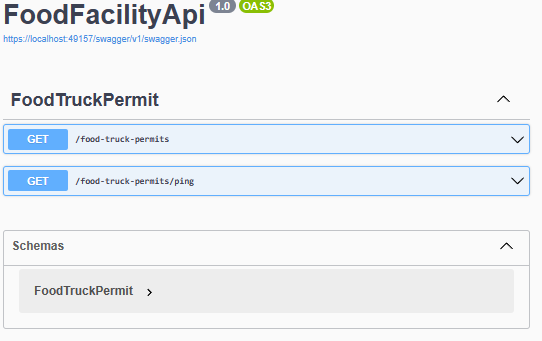
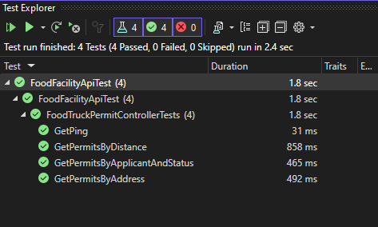

# FoodFacilityApi

## Problem Description
Given the data about Mobile Food Facilities in San Francisco (https://data.sfgov.org/Economy-and-Community/Mobile-Food-Facility-Permit/rqzj-sfat/data), build an API to perform the following operations on the data set:

- Search by name of applicant. Include optional filter on "Status" field.
- Search by street name. The user should be able to type just part of the address. Example: Searching for "SAN" should return food trucks on "SANSOME ST"
- Given a latitude and longitude, the API should return the 5 nearest food trucks. By default, this should only return food trucks with status "APPROVED", but the user should be able to override this and search for all statuses.
- We write automated tests and we would like you to do so as well.

## Problem Solution
This solution was created using Visual Studio 2022 and contains two .NET 7 projects: an ASP.NET Core Web API project and an xUnit Test Project.  Simply open the solution and press F5 while in the API project to view the Swagger.  

Right-click the test project and select run tests to run the tests.

The API contains a single controller class and two model classes.  All of the requirements are met by passing various combinations of values for FoodTruckPermitSearchParams properties which are translated into requests against the SF food facility API endpoint.  Refer to [FoodTruckControllerPermitTests.cs](FoodFacilityApiTest\FoodTruckControllerPermitTests.cs) for the specifics of each requirement.

## Bonus
The API provides an OpenAPI/Swagger UI that documents the API and allows easy testing via "try it now."  This API can be run via the dockerfile.

## References
- http://datasf.org/opendata/developers provides information on how to develop against the SF data set
- https://dev.socrata.com/docs/functions shows advanced query options for the source data endpoint
- https://timdeschryver.dev/blog/how-to-test-your-csharp-web-api#a-simple-test was used as the basis for the integration tests

## Design Discussion
I considered using the new "minmal" option but stuck with the tried and true MVC style since I was already familiar with it, although minimal might have been more appropriate for a small set of requirements like these.  I chose to implement only functional/integration tests which I feel give the most coverage with the least code.  As a result, I didn't have to inject service implementations into the controller, although these would be required to support true unit tests with mocks.  I didn't want to pollute the API with a bunch of special-purpose operations, so I implemented a single GET operation that takes query parameters.

## Critiques
- implement request and response logging via an action filter
- log the request and response from SF data service
- put things like the URI in the appsettings files
- create a test base class to DRY the tests
- used an API token to query the SF data to avoid potential throttling described in https://dev.socrata.com/consumers/getting-started.html
- injected a service for the SF data into the controller to allow mocking for unit tests allowing return of specific data instead of relying on the live data

I spent about 4 hours on this solution.

